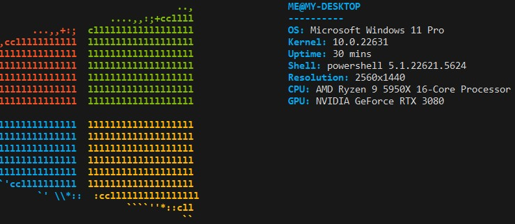

# This is a basic program that displays system info for windows like neofetch

It allows for customisation, you can change whatever you'd like within the `config()` function found inside the `config.go` file if you want to change your config
 
If you want to add a new ascii logo, all you have to do is to navigate to `logos/` and add in a new file representing the new logo. The logo must be presented in the following format: 
  -  First line should be `[rgb(100,100,100) rgb(200,200,200) rgb(50,50,50) rgb(1,1,1) rgb(2,2,1) rgb(5,5,5)]` You can change the actual values inside the brackets, but you MUST KEEP EVERYTHING THE SAME, EVEN THE WHITESPACE OR ELSE PROGRAM WILL CRASH, each value inside the square brackets corresponds to c1, c2, c3, ..., c6
  - The rest of the file is used for storing the actual ascii logo, if you'd like to use some of the colours you defined on the first line of the file, use `${c1}` and everything after that will have that colour, you can replace c1 for any other colour you have defined

Some functions that are useful for writing your config file
 `displayLogo()` takes in a string that is the name of the txt file for the logo you want to use without the `.txt` at the end
 `displayInfo()` is used to display a piece of info like `OS: Windows`, in this case, the first argument would be `"OS"`, and the second argument would be `"Windows"`
 `printWhitespace()` takes in an integer which is the number of newlines you want to print, use this instead of manually printing newlines or else things will break
